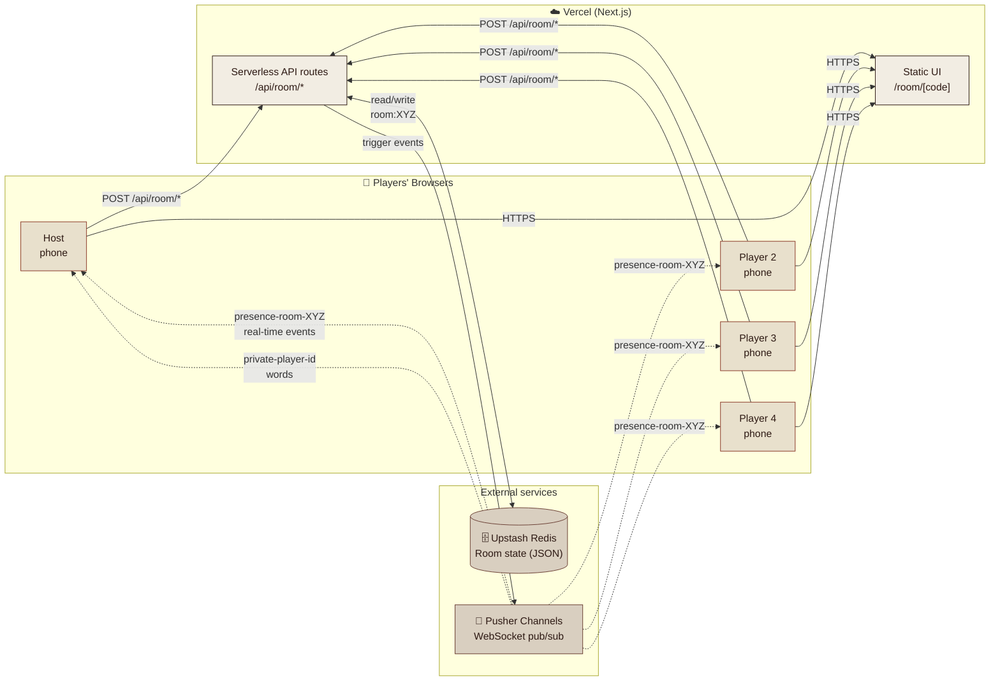
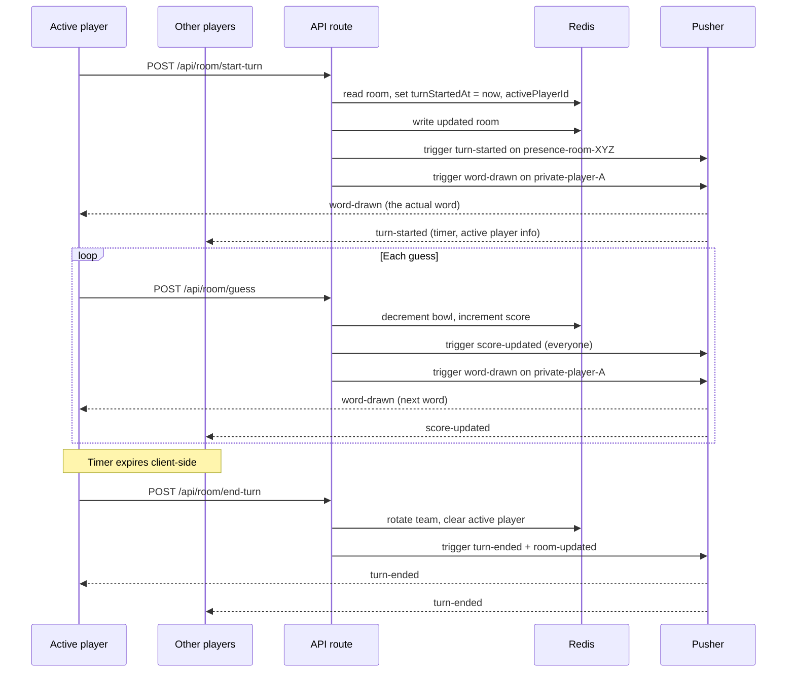

# Fishbowl

A mobile-first, multiplayer web implementation of the party game **Fishbowl** (sometimes called Salad Bowl). Create a room, submit words, and play three rounds — Describe, Charades, One Word Only — with your friends on their own phones. No app install, no account.

Built as a static Next.js app on **Vercel**, with **Pusher** for real-time events and **Upstash Redis** for shared room state.

## Quick start

```bash
npm install
cp .env.local.example .env.local   # then fill in your credentials
npm run dev
```

Open http://localhost:3000.

## Tech stack

| Layer | Choice | Why |
|-------|--------|-----|
| Framework | Next.js 16 App Router | Serverless-first, file-based routing, TS built in |
| Real-time | Pusher Channels | Hosted pub/sub — no long-lived server needed |
| State store | Upstash Redis (REST) | Shared room state across stateless API calls |
| Styling | Tailwind v4 + inline styles | Vintage paper aesthetic, custom per-component |
| Hosting | Vercel | Zero-config Next.js deploys |

## Architecture



### Event flow for a single turn



## Why Pusher and Redis?

**Vercel's serverless runtime is stateless.** Each API call runs in a fresh, short-lived container with no shared memory and no persistent network connections. This is great for scaling, but it means:

- We can't hold WebSocket connections open → **Pusher** is the always-on middleman. We POST events to Pusher; Pusher pushes them to every browser subscribed to the room channel.
- We can't keep room state in process memory → **Upstash Redis** (REST API) stores the room as JSON, keyed by room code, read/written by every API call.

Between them, Pusher handles the *push* side (server → many clients) and Redis handles the *shared memory* side (any API call can read the latest room state).

## Data model

One JSON blob per room in Redis:

```ts
type Room = {
  code: string                 // e.g. "NG5QK"
  hostId: string
  status: 'lobby' | 'submitting' | 'ready' | 'playing' | 'roundEnd' | 'gameOver'
  wordsPerPerson: number
  players: Player[]
  bowl: Word[]                 // reshuffled each round
  enabledRoundTypes: RoundType[]  // subset of ['describe','charades','oneWord']
  currentRoundIndex: number
  currentTeamIndex: number
  teamTurnIndices: [number, number]
  activePlayerId: string | null
  turnStartedAt: number | null  // epoch ms
  scores: number[][]            // [team][round]
  submittedPlayerIds: string[]
  skippedWordId: string | null
}
```

Rooms expire after 4 hours of inactivity (Redis TTL).

## Real-time channels

| Channel | Who subscribes | Events |
|---------|---------------|--------|
| `presence-room-{code}` | Everyone in the room | `room-updated`, `turn-started`, `score-updated`, `turn-ended`, `game-over` |
| `private-player-{id}` | Only that player | `word-drawn` (so spectators can't peek at the active player's word) |

## Game flow

1. **Home** → Create or Join with a name
2. **Lobby** → host picks words-per-person and which round types, then starts
3. **Word submission** → each player adds N words; once all in, the bowl is shuffled
4. **Playing** → teams take turns; 60s timer per turn, server validates timer on end-turn
5. **Round end** → scores shown; bowl refills from the original words, team rotates
6. **Game over** → final scorecard + confetti + "Play Again"

## Environment variables

See `.env.local.example`. You need:

- **Upstash Redis**: `UPSTASH_REDIS_REST_URL`, `UPSTASH_REDIS_REST_TOKEN` — from [console.upstash.com](https://console.upstash.com)
- **Pusher Channels**: `PUSHER_APP_ID`, `PUSHER_KEY`, `PUSHER_SECRET`, `PUSHER_CLUSTER`, `NEXT_PUBLIC_PUSHER_KEY`, `NEXT_PUBLIC_PUSHER_CLUSTER` — from [dashboard.pusher.com](https://dashboard.pusher.com)

The `NEXT_PUBLIC_*` duplicates exist because Next.js only exposes env vars prefixed with `NEXT_PUBLIC_` to the browser.

## Deploy

Push to GitHub → import into Vercel → paste all 8 env vars → Deploy.

Both Pusher and Upstash free tiers are plenty for house-party use (200k messages/day on Pusher, 10k commands/day on Upstash).

## Design

Visual aesthetic: **Vintage Paper Archive** — warm cream + red palette, letterpress stamp buttons, cursive display type, paper-grain overlay. Fonts: *Big Bird Standard* for stamp labels, *Pinyon Script* for display, *Courier Prime* for body.

## Project structure

```
app/
  page.tsx                  — Home (create/join)
  room/[code]/page.tsx      — Game shell (all phases)
  api/room/                 — All game mutations
  api/pusher/auth/          — Pusher channel authorization
lib/
  redis.ts                  — Upstash client + helpers
  pusher.ts                 — Pusher server + client helpers
  game-logic.ts             — Pure functions: rounds, teams, draws
types/
  game.ts                   — Shared TypeScript types
public/fonts/               — Big Bird Standard woff2
```
